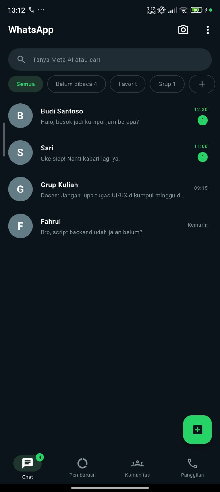
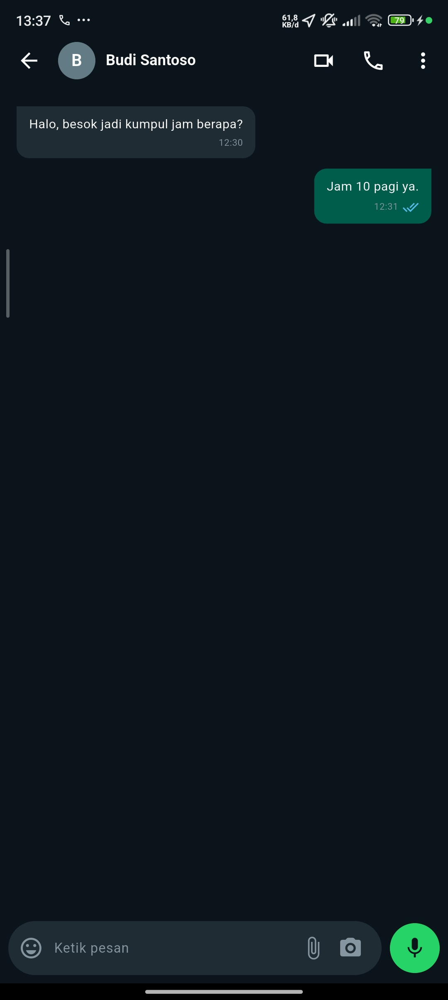
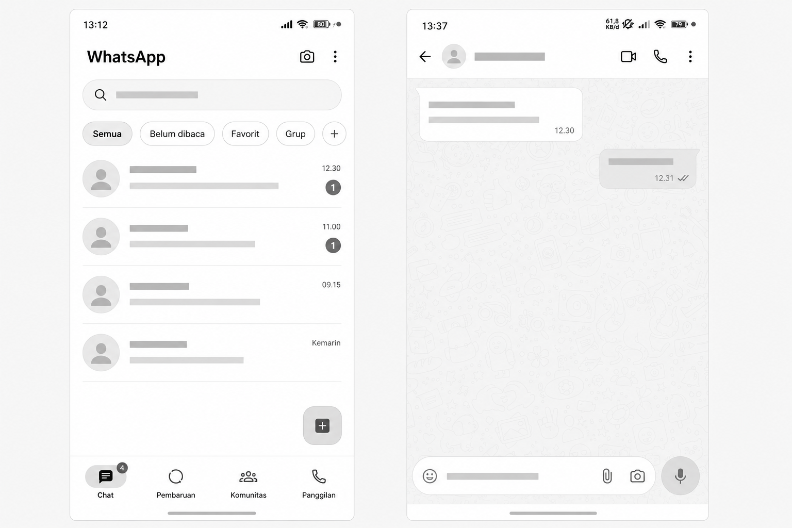

# Tugas UI/UX Flutter - WhatsApp Clone

## Identitas
- **Nama:** Suraya Akbar
- **NIM:** [11203362410132]
- **Pilihan:** A

## Deskripsi Singkat
Aplikasi ini adalah hasil replikasi antarmuka (User Interface) dari aplikasi WhatsApp dengan mengusung tema mode gelap (Dark Mode). Proyek ini terdiri dari dua halaman utama:
1. **Halaman Beranda (Chat List):** Menampilkan daftar obrolan kontak, bilah pencarian (Search Bar Meta AI), filter chips kategori, tombol Floating Action Button, dan Bottom Navigation Bar.
2. **Halaman Percakapan (Chat Room):** Menampilkan detail ruang obrolan ketika kontak diklik, lengkap dengan struktur *bubble chat* yang memiliki ekor lancip, timestamp, ikon *read receipt*, serta kolom input teks di bagian bawah.

## Widget yang Digunakan
- `Scaffold` – Menyediakan kerangka dasar aplikasi (menampung AppBar, body, FAB, dan BottomNavigationBar).
- `AppBar` – Membuat bagian header aplikasi di atas layar.
- `ListView.builder` & `ListView` – Membuat daftar elemen yang dapat di-scroll vertikal untuk daftar chat dan *bubble chat*.
- `ListTile` – Membangun struktur baris item obrolan yang rapi.
- `CircleAvatar` – Menampilkan inisial foto profil pengguna dan indikator *badge* pesan belum dibaca.
- `BottomNavigationBar` – Membuat menu navigasi di bagian bawah layar.
- `FloatingActionButton` – Tombol aksi melayang untuk interaksi pesan baru.
- `Container` & `Padding` – Membungkus elemen untuk memberikan ruang (spacing), warna latar, dan lengkungan sudut (border radius).
- `Row` & `Column` – Menyusun elemen secara horizontal dan vertikal.
- `TextField` – Menyediakan kolom input teks di ruang obrolan.
- `SingleChildScrollView` – Membuat *filter chips* dapat digeser ke samping (horizontal).

## Screenshot
**Halaman Beranda:**

**Halaman Chat Room:**

## Wireframe

## Kesulitan yang Ditemui
Kesulitan utama yang ditemui adalah menyesuaikan tata letak komponen agar presisi dan mirip dengan WhatsApp versi terbaru, terutama saat mengimplementasikan detail *bubble chat* (membuat ekor lancip di satu sudut) dan merapikan kolom input pesan agar tidak *overflow*. Cara mengatasinya adalah dengan mengatur nilai `Radius.circular(0)` pada satu sudut `BoxDecoration` dan menggunakan widget `Expanded` secara tepat agar elemen fleksibel mengisi sisa ruang yang ada.
